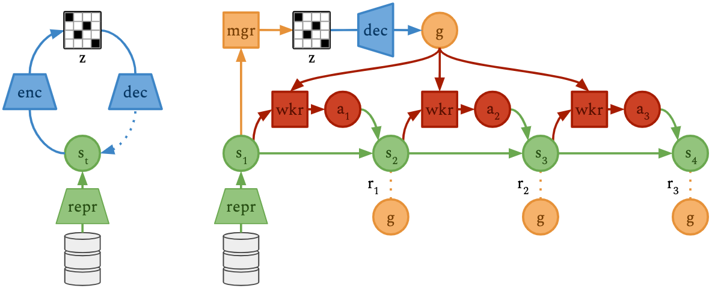
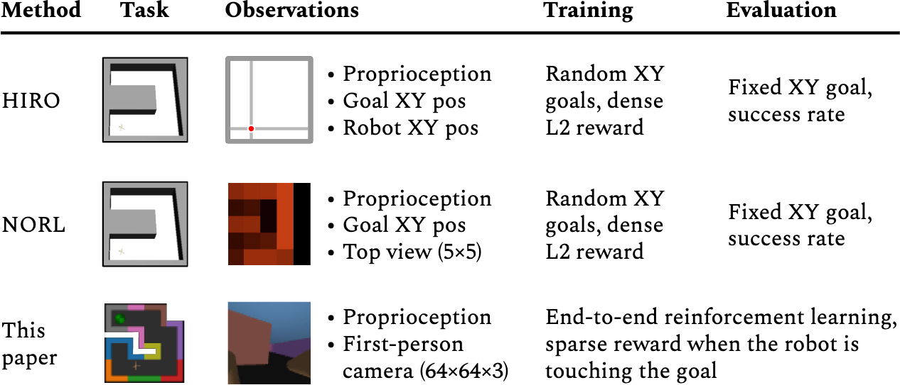
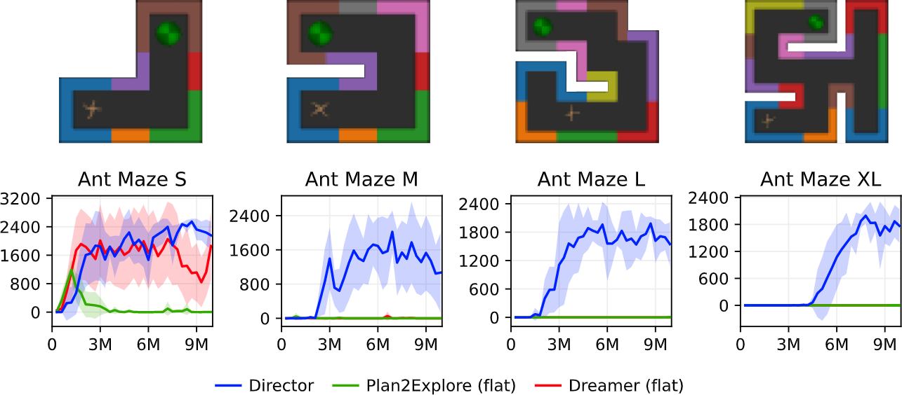
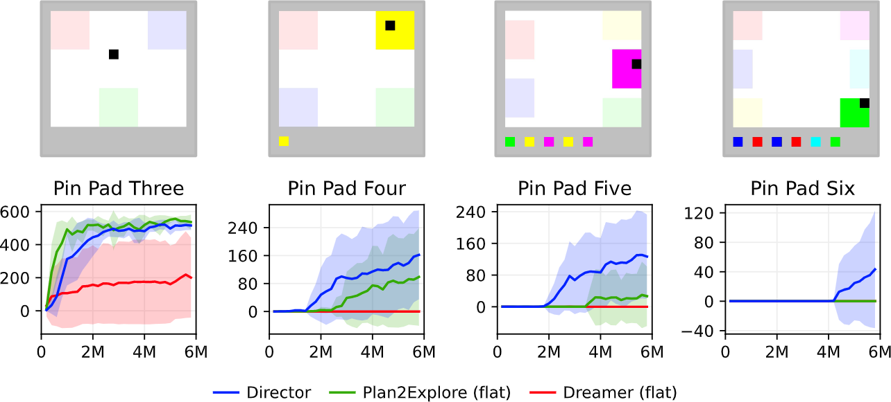
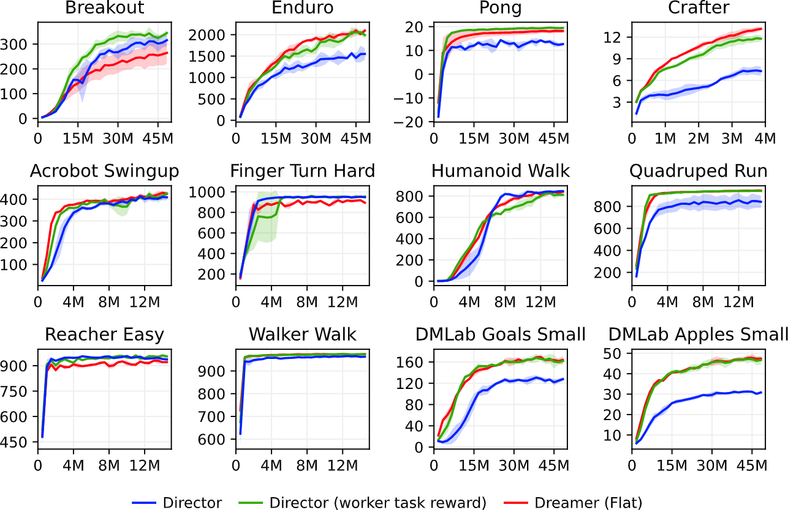

<header>
<h1>Deep Hierarchical Planning from Pixels</h1>

Anonymous Website for Peer Review.

Please do not try to find the repository that hosts this website.

</header>

<!-- ## Introducing Director -->
<!-- TODO: gif composition of many different domains -->
<!-- TODO: summary of contributions, insights, and results -->

## How Director Works

We introduce Director, a reinforcement learning agent that learns hierarchical
behaviors from pixels by planning inside of a learned world model:

This is how Director works:

- The
world model
provides continuous 1024-dimensional representations and allows planning in
this space.

- The
goal autoencoder
compresses the world model representations into compact discrete codes.

- The
manager
selects codes in this discrete space every 8 steps. The goal autoencoder
decodes these codes into feature space goals.

- The
worker
learns to reach these goals via a feature space distance.

The manager maximizes **task reward** plus **exploration bonus** and the worker
only learn from the **feature distance**. Both policies learn from shared
imagind rollouts.

All model components are optimized concurrently and throughout learning on
end-to-end reinforcement learning tasks.

## Egocentric Ant Maze Benchmark

Prior work often resorted to custom evaluation protocols, such as assuming
diverse practice goals during training, providing top-down XY coordinates to
the agent, and requiring dense ground-truth distance rewards. In this paper, we
train end-to-end on reinforcement learning tasks with very sparse rewards
directly from raw sensory inputs, without assuming access to semantic goal
spaces.

In this benchmark, a quadruped robot is controlled through joint torques to
navigate to a fixed location in a 3D maze, given only first-person camera and
proprioceptive inputs. The only reward is given at time steps where the agent
touches the reward object. Director solves all four tasks by breaking them down
into manageable subgoals that the worker can reach.

## Visual Pin Pad benchmark

The agent controls the black square to move in four directions. Each
environment has a different number of pads that can be activated by walking to
and stepping on them. A single sparse reward is given when the agent activates
all pads in the correct sequence. The history of previously activated pads is
shown at the bottom of the screen. Unlike prior algorithms, Director succeeds
across difficulty levels.

## Standard Benchmarks

To evaluate the generality of Director, we train on a wide range of standard
benchmarks, including continuous control from pixels, Atari games, DMLab mazes,
and Crafter. We find that Director learns successfully across all these
domains, despite the worker learning only from the intrinsic goal reward. When
additionally giving task reward to the worker, Director fully closes the gap to
Dreamer, demonstrating that Director is a generally applicable RL algorithm.

## Goal Visualizations

While Director uses latent feature vectors as goals, the world model allows us
to decode them into images for human inspection. Each video shows:

- **Left:** The environment inputs of an episode as seen by the agent
- **Right:** The visualized goals that Director chooses internally

As you will see, the goals are usually ahead of what the agent is currently
doing. The agent rarely reaches its internal goals because once it comes close,
the manager already proposes the next goal that is further ahead.

### Visual Pin Pad Six

There is only one sparse reward after activating all pads in the right order.
The manager directs the worker mainly via the history display at the bottom of
the image but also via the position of the black player square.

<video autoplay muted loop controls><source src="goals/pinpad6.mp4"></video>

### Egocentric Ant Maze M

<video autoplay muted loop controls><source src="goals/mazem.mp4"></video>

### Egocentric Ant Maze XL

<video autoplay muted loop controls><source src="goals/mazexl.mp4"></video>

### Cartpole Swingup

<video autoplay muted loop controls><source src="goals/cartpole.mp4"></video>

### Acrobot Swingup

<video autoplay muted loop controls><source src="goals/acro.mp4"></video>

### Walker Walk

The manager abstracts away the detail of leg movement, directing the worker
through a forward-leaning pose with both feed above the ground and a shifting
floor pattern. The worker fills in the leg movement to pass through the goals.

<video autoplay muted loop controls><source src="goals/walker.mp4"></video>

### Humanoid Walk

<video autoplay muted loop controls><source src="goals/humanoid.mp4"></video>

### Atari Pong

Because the game is reactive and requires no long-term reasoning, the manager
learns to communicate the task to the worker by requesting a higher score via
the score display at the top of the screen.

<video autoplay muted loop controls><source src="goals/pong.mp4"></video>

### Crafter

The manager directs the worker via the item display to collect wood and create
a pickaxe. It then sends the worker to a cave to collect stone and iron. As it
gets dark, the manager tells the worker to find a small cave or island to hide
from mosters.

<video autoplay muted loop controls><source src="goals/crafter.mp4"></video>

### DMLab Goals Small

<video autoplay muted loop controls><source src="goals/dmlab.mp4"></video>

## Without Goal Autoencoder

Director uses a goal autoencoder to aid manager learning by providing a
discretized action space and allowing only goals that are similar to states
from the replay buffer.

As an ablation, we here show the selected goals if we remove the goal
autoencoder and the manager directly chooses goal vectors in the continuous
feature space of the world model.

Just like before, each video shows:

- **Left:** The environment inputs of an episode as seen by the agent
- **Right:** The visualized goals that Director chooses internally

As you can see, the goals are completely uninterpretable and cause the agent to
fail in many, but not all, of the tested environments.

### Visual Pin Pad Five

<video autoplay muted loop controls><source src="noae/pinpad5.mp4"></video>

### Walker Walk

<video autoplay muted loop controls><source src="noae/walker.mp4"></video>

### Humanoid Walk

<video autoplay muted loop controls><source src="noae/humanoid.mp4"></video>

### Crafter

<video autoplay muted loop controls><source src="noae/crafter.mp4"></video>

### DMLab Goals Small

<video autoplay muted loop controls><source src="noae/dmlab.mp4"></video>

<!-- ## Replay Goals -->
<!-- ## Instructions -->
<!-- The code is available for download: [director.zip](director.zip) -->
