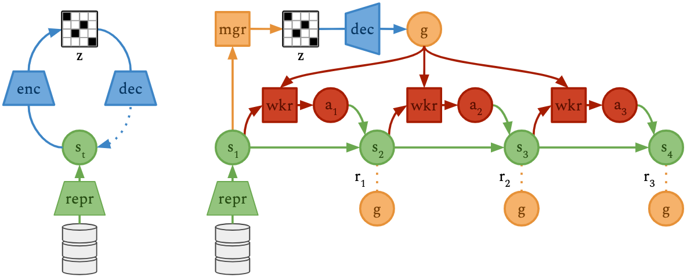
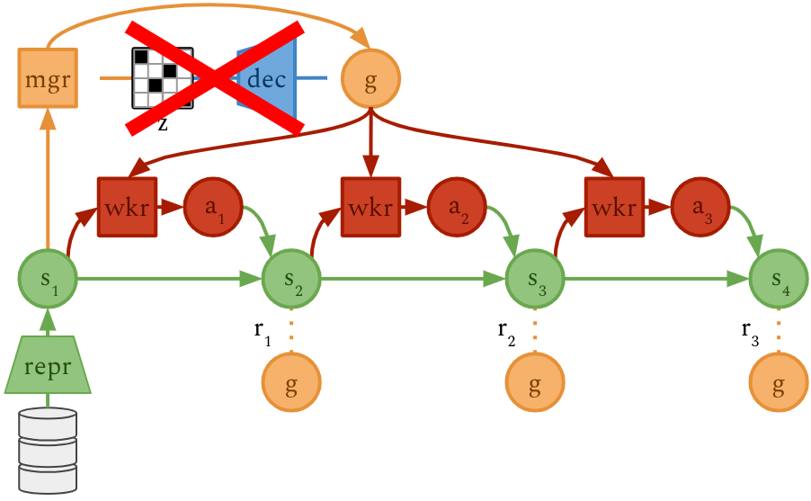

<header>
<h1>Deep Hierarchical Planning from Pixels</h1>
<h2>Anonymous Website for Peer Review</h2>
</header>

Please do not try to find the repository that hosts this website.

## Director Agent

## Goal Visualizations

Each video shows the **agent inputs along an episode on the left** and the
**decoded latent goals that Director uses internally on the right**.

As you can see, the goals are usually ahead of what the agent is currently
doing. The agent rarely reaches its internal goals because once it comes close,
the manager already proposes the next goal that is further ahead.

### Visual Pin Pad Six

There is only one sparse reward after activating all pads in the right order.
The manager directs the worker mainly via the history display at the bottom of
the image but also via the position of the black player square.

<video autoplay muted loop controls><source src="goals/pinpad6.mp4"></video>

### Egocentric Ant Maze M

<video autoplay muted loop controls><source src="goals/mazem.mp4"></video>

### Egocentric Ant Maze XL

<video autoplay muted loop controls><source src="goals/mazexl.mp4"></video>

### Cartpole Swingup

<video autoplay muted loop controls><source src="goals/cartpole.mp4"></video>

### Acrobot Swingup

<video autoplay muted loop controls><source src="goals/acro.mp4"></video>

### Walker Walk

The manager abstracts away the detail of leg movement, directing the worker
through a forward-leaning pose with both feed above the ground and a shifting
floor pattern. The worker fills in the leg movement to pass through the goals.

<video autoplay muted loop controls><source src="goals/walker.mp4"></video>

### Humanoid Walk

<video autoplay muted loop controls><source src="goals/humanoid.mp4"></video>

### Atari Pong

Because the game is reactive and requires no long-term reasoning, the manager
learns to communicate the task to the worker by requesting a higher score via
the score display at the top of the screen.

<video autoplay muted loop controls><source src="goals/pong.mp4"></video>

### Crafter

The manager directs the worker via the item display to collect wood and create
a pickaxe. It then sends the worker to a cave to collect stone and iron. As it
gets dark, the manager tells the worker to find a small cave or island to hide
from mosters.

<video autoplay muted loop controls><source src="goals/crafter.mp4"></video>

## Without Goal Autoencoder

Director uses a goal autoencoder to aid manager learning by providing a
discretized action space and allowing only goals that are similar to states
from the replay buffer.

As an ablation, we here show the selected goals if we remove the goal
autoencoder and the manager directly chooses goal vectors in the continuous
feature space of the world model.

Each video shows the **agent inputs along an episode on the left** and the
**decoded latent goals that the hierarchy uses internally on the right**.

As you can see, the goals are completely uninterpretable and cause the agent to
fail in many, but not all, of the tested environments.

<video autoplay muted loop controls><source src="noae/pinpad5.mp4"></video> 
<video autoplay muted loop controls><source src="noae/walker.mp4"></video> 
<video autoplay muted loop controls><source src="noae/humanoid.mp4"></video> 
<video autoplay muted loop controls><source src="noae/crafter.mp4"></video> 
<video autoplay muted loop controls><source src="noae/dmlab.mp4"></video>

<!-- ## Replay Goals -->
<!-- ## Instructions -->
<!-- The code is available for download: [director.zip](director.zip) -->
